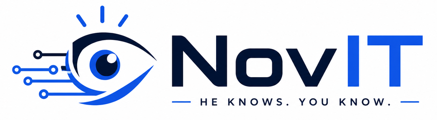
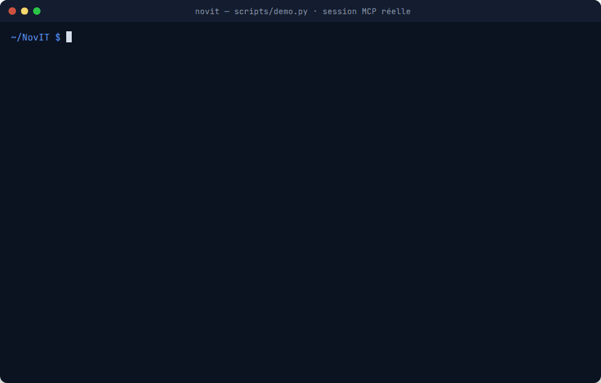
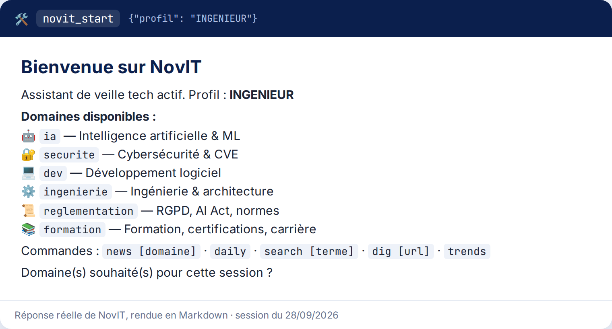
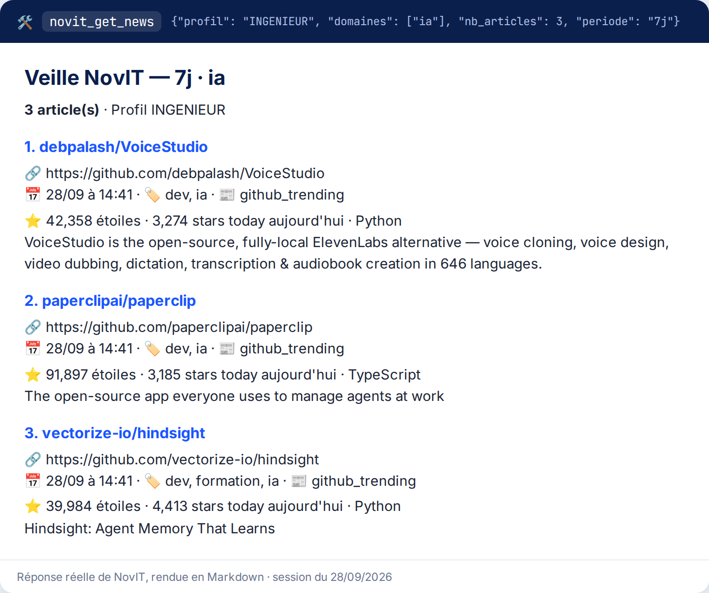

<p align="center">
  <picture>
    <source media="(prefers-color-scheme: dark)" srcset="docs/assets/logo-dark.png">
    
  </picture>
</p>

<p align="center">
  <strong>Il sait, il connaît l'IT.</strong><br>
  La veille technologique en temps réel, directement dans Claude, grâce au protocole MCP.
</p>

<p align="center">
  <a href="VERSION"></a>
  <a href="https://github.com/rmouahid/NovIT/issues/93"></a>
  <a href="https://github.com/rmouahid/NovIT/actions/workflows/ci.yml"></a>
  <a href="LICENSE"></a>
  
  
</p>

<p align="center">
  <a href="#installation"><strong>🚀 Installer</strong></a> ·
  <a href="#contribuer"><strong>🤝 Contribuer</strong></a> ·
  <a href="https://github.com/rmouahid/NovIT/issues/new?template=bug_report.yml"><strong>🐛 Signaler un bug</strong></a> ·
  <a href="docs/USER_GUIDE.md">📖 Guide utilisateur</a>
</p>

<p align="center">
  
  <br>
  <sub>Session réelle enregistrée avec <a href="scripts/demo.py"><code>scripts/demo.py</code></a> : le serveur NovIT est lancé en stdio et interrogé comme le ferait Claude.</sub>
</p>

---

## Pourquoi NovIT ?

Claude possède une date de coupure de connaissance. NovIT lui donne accès à l'actualité tech **en temps réel**, de manière structurée et personnalisée, sans que l'utilisateur ait à copier-coller des articles.

NovIT est un **serveur MCP (Model Context Protocol)** : il expose des outils que Claude appelle pour récupérer, filtrer et synthétiser l'information de plus de 20 sources (actualités, IA, sécurité, ingénierie, réglementation, formation), selon le profil de l'utilisateur.

- **Personnalisé** : un profil ETUDIANT (pédagogique) ou INGENIEUR (technique et concis), et vos domaines favoris
- **Structuré** : des réponses Markdown homogènes (titre, lien, date, domaines, source) que Claude peut citer
- **Local** : il tourne sur votre machine, sans compte ni clé d'API obligatoire

---

## NovIT en action

<table>
  <tr>
    <td width="50%" valign="top"></td>
    <td width="50%" valign="top"></td>
  </tr>
  <tr>
    <td align="center"><sub><code>novit_start</code> : accueil et domaines disponibles</sub></td>
    <td align="center"><sub><code>novit_get_news</code> : dernières actualités IA, profil INGENIEUR</sub></td>
  </tr>
</table>

<sub>Réponses réelles des outils, rendues en Markdown comme dans une conversation. Plus d'exemples par profil dans <a href="docs/EXAMPLES.md">docs/EXAMPLES.md</a>.</sub>

---

## Fonctionnalités

### Outils MCP exposés

| Outil | Description |
|---|---|
| `novit_start` | Initialise NovIT : sélection du profil, menu de bienvenue personnalisé |
| `novit_get_news` | Dernières actualités tech filtrées selon le profil et les domaines |
| `novit_daily` | Résumé de veille quotidien, groupé par domaine |
| `novit_search` | Recherche plein texte dans les articles en cache |
| `novit_get_by_domain` | Articles filtrés par domaine technologique |
| `novit_trends` | Sujets tendance et thèmes en montée rapide sur 7 jours |
| `novit_unusual` | Articles insolites, hors des sentiers battus (profil ETUDIANT) |
| `novit_related` | Articles similaires à un article donné (URL ou titre) |
| `novit_dig` | Contenu complet d'un article à partir de son URL |
| `novit_get_profile` | Informations et préférences d'un profil |
| `novit_set_profile` | Change le profil actif et le persiste |
| `novit_set_domains` | Définit les domaines actifs de la session |
| `novit_health` | État de santé du serveur (uptime, cache, sources) |

### Profils utilisateur

- **ETUDIANT** : ton pédagogique, vulgarisation, découvertes insolites, sources accessibles
- **INGENIEUR** : ton technique, concision, CVE/sécurité, blogs d'ingénierie avancés

### Sources couvertes

| Catégorie | Sources |
|---|---|
| Actualités tech | Hacker News, TechCrunch, The Verge, MIT Tech Review |
| Intelligence artificielle | Anthropic Blog, OpenAI Blog, DeepMind, arXiv cs.AI, Papers With Code |
| Ingénierie | GitHub Trending, Netflix Tech Blog, Google Eng Blog, Meta Eng Blog |
| Sécurité | CVE/NVD, ANSSI Cert-FR |
| Réglementation | CNIL, EUR-Lex (AI Act), W3C News |
| Formation | freeCodeCamp, Roadmap.sh, Stack Overflow Survey |

Une source manque ? [Proposez-la](https://github.com/rmouahid/NovIT/issues/new?template=new_source.yml) ou ajoutez-la vous-même avec le [système de plugins](docs/PLUGINS.md).

---

## Installation

### Prérequis

- Python 3.11+
- [Claude Desktop](https://claude.ai/download) avec support MCP
- Git

### Étapes

```bash
# 1. Cloner le dépôt
git clone https://github.com/rmouahid/NovIT.git
cd NovIT

# 2. Créer l'environnement virtuel
python -m venv .venv
source .venv/bin/activate        # Linux/macOS
# .venv\Scripts\activate         # Windows

# 3. Installer les dépendances
pip install -r requirements.txt  # production
# ou
pip install -r requirements-dev.txt  # développement

# 4. Configurer les variables d'environnement
cp .env.example .env
# Éditer .env avec vos valeurs (optionnel pour commencer)

# 5. Vérifier l'installation : session de démonstration sur les sources en direct
python scripts/demo.py
```

> Le paquet PyPI (`pip install novit`) arrive avec la version 1.0 ([#93](https://github.com/rmouahid/NovIT/issues/93)).

### Connecter à Claude Desktop

Ajouter dans la configuration MCP de Claude Desktop :

```json
{
  "mcpServers": {
    "novit": {
      "command": "python",
      "args": ["-m", "src.mcp"],
      "cwd": "/chemin/vers/NovIT"
    }
  }
}
```

Le guide complet (configuration, vérification, dépannage, Docker) est dans [docs/INSTALLATION_GUIDE.md](docs/INSTALLATION_GUIDE.md).

---

## Quickstart

Une fois le serveur connecté à Claude :

```
Vous : Lance NovIT, je suis ingénieur
Claude : [utilise novit_start avec profil=INGENIEUR]

Vous : Quelles sont les dernières news en IA ?
Claude : [utilise novit_get_news avec profil=INGENIEUR, domaines=["ia"]]

Vous : Creuse cet article sur les LLMs
Claude : [utilise novit_dig avec l'URL de l'article]

Vous : Y a-t-il des CVE critiques cette semaine ?
Claude : [utilise novit_get_by_domain avec domaine=securite]
```

---

## Architecture

```
NovIT/
├── src/
│   ├── mcp/        # Serveur MCP (SDK `mcp`, transport stdio) + handlers
│   ├── scrapers/   # Un scraper par source (HN, GitHub, CVE…)
│   ├── profiles/   # Logique de filtrage par profil
│   └── prompts/    # Prompts système et templates
├── tests/          # Tests unitaires et d'intégration
├── docs/           # Documentation technique
├── config/         # Configuration YAML (sources, profils, domaines)
└── scripts/        # Scripts utilitaires (démo, déploiement)
```

Voir [docs/ARCHITECTURE.md](docs/ARCHITECTURE.md) pour la vue détaillée.

---

## Contribuer

NovIT est open source et les contributions sont les bienvenues, du signalement de bug à l'ajout d'une source.

| Vous voulez… | Par où commencer |
|---|---|
| 🐛 Signaler un bug | [Ouvrir un rapport de bug](https://github.com/rmouahid/NovIT/issues/new?template=bug_report.yml) |
| ✨ Proposer une fonctionnalité | [Ouvrir une proposition](https://github.com/rmouahid/NovIT/issues/new?template=feature_request.yml) |
| 📡 Ajouter une source | [Proposer une source](https://github.com/rmouahid/NovIT/issues/new?template=new_source.yml) · [Guide](docs/ADDING_A_SOURCE.md) · [Plugins](docs/PLUGINS.md) |
| 💬 Poser une question | [Discussions](https://github.com/rmouahid/NovIT/discussions) |
| 🧑‍💻 Écrire du code | [Guide de contribution](CONTRIBUTING.md) · [issues « good first issue »](https://github.com/rmouahid/NovIT/issues?q=is%3Aissue+is%3Aopen+label%3A%22good+first+issue%22) |

### Développement

```bash
# Installer les hooks pre-commit
pip install pre-commit
pre-commit install

# Lancer les tests
pytest

# Vérifier le formatage
black src/ tests/
ruff check src/ tests/
```

---

## Documentation

- [Guide d'installation complet](docs/INSTALLATION_GUIDE.md)
- [Guide utilisateur](docs/USER_GUIDE.md)
- [Documentation technique](docs/TECHNICAL_DOCUMENTATION.md) (modules, outils MCP, débogage)
- [Exemples de requêtes](docs/EXAMPLES.md) (par profil, question → réponse attendue)
- [Système de plugins de scrapers](docs/PLUGINS.md) (ajouter une source sans toucher au dépôt)
- [Déploiement cloud](docs/CLOUD_DEPLOYMENT.md) (préparation — Fly.io, non déployable à ce jour)
- [Guide de prompting](docs/PROMPTING_GUIDE.md)
- [Architecture](docs/ARCHITECTURE.md) · [Décisions d'architecture (ADR)](docs/ADR/)
- [Guide de contribution](CONTRIBUTING.md) · [Gouvernance](GOVERNANCE.md) · [Code de conduite](CODE_OF_CONDUCT.md)
- [Roadmap](docs/ROADMAP.md)
- [Changelog](CHANGELOG.md)

---

## Licence

MIT — voir [LICENSE](LICENSE)
